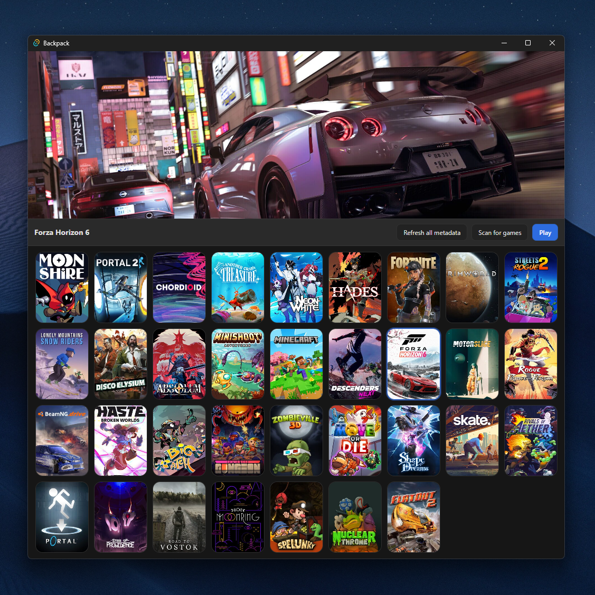

# Backpack



Backpack is a lightweight desktop game launcher built with [Tauri](https://tauri.app/) and [SvelteKit](https://kit.svelte.dev/). It scans your machine for installed games across stores (Steam, Epic, and Windows UWP/appx apps), pulls cover art, key art, and descriptions from [IGDB](https://www.igdb.com/), and presents everything in a single grid you can launch from. It lives in the system tray and tracks running games so you can jump back into your library at any time.

## Features

- Automatic scanning for installed games across supported platforms.
- Cover art, key art, and summaries fetched and cached from IGDB.
- Manual metadata search to fix or override any title.
- Runs in the system tray with one-click launching.
- Cross-platform: macOS, Windows, and Linux.

## Prerequisites

- [Node.js](https://nodejs.org/) (18+) and npm
- [Rust](https://www.rust-lang.org/tools/install) and Cargo (stable toolchain)
- Platform-specific Tauri dependencies — see the [Tauri prerequisites guide](https://tauri.app/start/prerequisites/)

## IGDB credentials

Metadata is sourced from IGDB, which authenticates through Twitch. You'll need a Twitch developer application to get credentials:

1. Create an application at the [Twitch Developer Console](https://dev.twitch.tv/console/apps).
2. Note your **Client ID** and generate a **Client Secret**.

Backpack reads credentials from environment variables. You can either let it request an access token for you, or provide a token directly.

**Option A — let Backpack fetch the token (recommended):**

```sh
export IGDB_CLIENT_ID="your_client_id"
export IGDB_CLIENT_SECRET="your_client_secret"
```

**Option B — provide a token you already generated:**

```sh
export IGDB_CLIENT_ID="your_client_id"
export IGDB_ACCESS_TOKEN="your_access_token"
```

> The `TWITCH_CLIENT_ID`, `TWITCH_CLIENT_SECRET`, and `TWITCH_ACCESS_TOKEN` variable names are also accepted as aliases. These variables must be present in the environment that launches Backpack (e.g. exported in your shell before running the commands below).

## Getting started

Install the JavaScript dependencies:

```sh
npm install
```

### Run in development

This starts the Vite dev server and the Tauri app with hot reload:

```sh
npm run tauri dev
```

### Build for production

This produces an optimized, bundled desktop application for your current platform:

```sh
npm run tauri build
```

The packaged installers/binaries are written to `src-tauri/target/release/bundle/`.

## License

Released under the MIT License.
